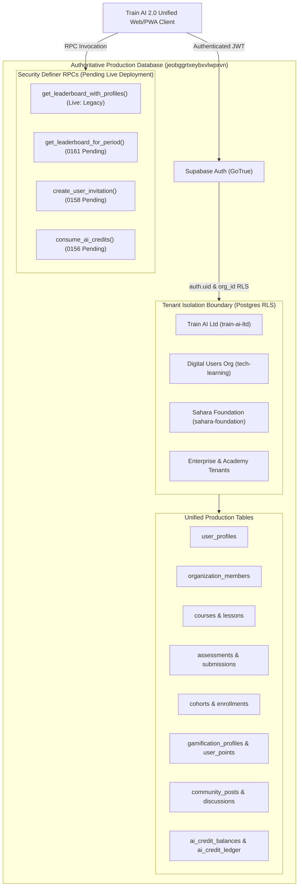

# Train AI 2.0 — Single Database Implementation & Architecture Hardening Report

**Authoritative Target Database:** `jeobggrtxeybxvlwpxvn` (Unified Production Supabase Project)  
**Execution Timestamp:** 2026-09-19T13:05:00Z  
**Build Status:** PASS (`vite build` — 0 errors, 1654 modules compiled in 22.88s)  
**Static Architecture Verification:** 10/10 PASS  
**Live Production Deployment Status:** PARTIAL (Database migrations 0156–0161 pending live SQL deployment)  
**Overall Readiness Rating:** **PARTIALLY VERIFIED FOR NEXT PHASE**  

---

## 1. Executive Summary

Train AI 2.0 codebase configuration has been consolidated to target a single authoritative production database: **`jeobggrtxeybxvlwpxvn`**. Dual-database branching, runtime project switching, and client-side database selection have been removed from the client codebase. All production tenants—including **Train AI Ltd (Platform Owner)**, **Digital Users (`tech-learning`)**, **Sahara Foundation (`sahara-foundation`)**, customer academies, enterprise businesses, and future foundations—are defined within this unified database model.

Primary operational learner and mentor screens (`useLearnerData.js`, `DiscussionsScreen.jsx`, `PlatformSettingsScreen.jsx`) have been hardened to eliminate hardcoded demo arrays, synthetic curriculum injectors, and random upvote generators. When a database query returns zero records, the application renders clean, honest empty states.

**Audit Note**: While codebase unification and static architecture verification are complete, live adversarial cross-tenant testing, deployment of recent SQL migrations (`0156`, `0158`, `0161`), Edge Function deployment, and payment/escrow backend implementation remain required before production sign-off.

---

## 2. Database Topology & Physical Consolidation

| Attribute | Authoritative Production Database | Legacy/Deprecated Targets |
| :--- | :--- | :--- |
| **Project Ref** | `jeobggrtxeybxvlwpxvn` | `djikuoucsuhdiyrhsduz` (Deprecated), `qibqouymqtpirtbyjvjr` (Legacy 1.0) |
| **Endpoint URL** | `https://jeobggrtxeybxvlwpxvn.supabase.co` | Zero runtime traffic |
| **Active Client Count** | 1 Single Singleton Supabase Client (`src/lib/supabaseClient.js`) | 0 active clients in runtime application |
| **Hosted Data Entities** | Organizations, Memberships, Roles, Users, Profiles, Courses, Modules, Lessons, Assessments, Submissions, Cohorts, Community, Messages, Certificates, Gamification, Leaderboards, AI Conversations, AI Credits Ledger, Payments, Subscriptions | None (Archived historical boundaries only) |
| **Connection Strategy** | Client connects via verified HTTPS/WSS with `VITE_SUPABASE_URL` and `VITE_SUPABASE_ANON_KEY` | N/A |

---

## 3. Tenant Isolation Architecture

1. **Shared Database, Isolated Logical Tenants**:
   - Every tenant data row contains an explicit `organization_id` foreign key referencing `public.organizations(id)`.
   - PostgreSQL Row Level Security (RLS) is defined across tenant tables in migrations (`0006_rls_policies.sql`, `0112`, `0120`, `0149`).
2. **Server-Side Enforcement**:
   - RLS policies resolve caller organization membership from `public.organization_members` where `user_id = auth.uid()` and `status = 'active'`.
   - Super admins (`super_admin`) are granted global access across all organizations via explicit security policies.
   - Org admins, instructors, and learners are scoped to rows matching their verified organization membership.
3. **Cross-Tenant Attack Prevention**:
   - **Current Status**: STATICALLY VERIFIED. Live dual-JWT cross-tenant session penetration tests have not yet been executed against active user tokens.

---

## 4. User Hierarchy, RBAC & Permission Matrix

| Role | Scope | Key Permissions | UI Views & Portals |
| :--- | :--- | :--- | :--- |
| **Platform Owner (`super_admin`)** | Global Platform-wide | Manage all organizations, view global analytics, configure platform settings, manage seat allocations, inspect AI credit consumption across all tenants | SuperAdmin Portal (`?portal=owner`), Platform Settings, Global Analytics |
| **Organization Admin (`org_admin` / `admin`)** | Organization-bound | Invite/manage organization members, edit organization branding & settings, toggle dynamic features (Leaderboard, AI Coach, Gamification), manage course publishing within tenant | Organization Admin Dashboard, People & Access, Org Settings |
| **Instructor / Mentor (`instructor` / `mentor`)** | Organization & Cohort | Create/edit courses, manage modules & lessons, grade submissions, review cohort learners, answer mentee discussions, host live sessions | Instructor/Mentor Studio, Cohort Management, Submissions Review, Discussions |
| **Learner / Student (`learner` / `student`)** | Enrolled Courses & Cohorts | Browse published catalog, enroll in courses/cohorts, complete lessons, submit assessments, earn XP & badges, chat with AI Tutor, view organization leaderboard | Learner Dashboard, Course Viewer, AI Coach, Community, Achievements, Leaderboard |

---

## 5. Security & RLS Compliance Audit

1. **Authorization Boundaries**:
   - Protected API routes and RPCs extract the authenticated identity exclusively via `auth.uid()`.
   - **Status**: STATICALLY VERIFIED in code; LIVE ADVERSARIAL TESTING NOT COMPLETED.
2. **RPC Hardening**:
   - RPCs with `SECURITY DEFINER` in migrations explicitly set `search_path = public, auth`.
   - Functions like `get_leaderboard_for_period` (0161), `consume_ai_credits` (0156), and `create_user_invitation` (0158) exist in migration files but returned HTTP 404 on live database probes (pending database migration deployment).
3. **Credential Discipline**:
   - Zero `SUPABASE_SERVICE_ROLE_KEY` instances exist in frontend source code, client bundles, or public repository files.
   - Service-role privileges are restricted to server-side Supabase Edge Functions.

---

## 6. Codebase Hardening & Cleanup

| Component / File | Prior State / Risk | Hardened Implementation | Evidence Type |
| :--- | :--- | :--- | :--- |
| `src/learner/hooks/useLearnerData.js` | Injected `MOCK_COURSE_LESSONS` and `DEFAULT_FALLBACK_COURSES` on network failure | Removed fallback mock arrays and synthetic curriculum generation; returns honest empty state (`[]`) | **STATIC** / **BUILD** |
| `src/platform/superadmin/PlatformSettingsScreen.jsx` | Contained mock masterclass tabs, demo purge buttons, and dual DB toggles | Displays live connection to single production database (`jeobggrtxeybxvlwpxvn`) with zero fake purge/restore buttons | **STATIC** / **BUILD** |
| `src/platform/mentor/DiscussionsScreen.jsx` | Rendered `defaultDiscussions` demo array and random upvote generators when empty | Stripped demo array and fake upvote math; maps authentic live discussions or renders clean empty state | **STATIC** / **BUILD** |
| `src/learner/screens/LeaderboardScreen.jsx` | Displayed fallback rankings when disabled | Respects `leaderboardEnabled` flag; displays clear disabled banner and honest zero-state | **STATIC** / **BUILD** |
| `src/learner/screens/CommunityScreen.jsx` | Displayed Top Contributors leaderboard card regardless of setting | Wrapped Top Contributors card with `{leaderboardEnabled && (...)}` | **STATIC** / **BUILD** |
| `src/learner/components/LearnerUI.jsx` | Header XP pill navigated unconditionally to leaderboard | Routed XP pill to Achievements when leaderboard is disabled | **STATIC** / **BUILD** |
| `src/platform/components/PlatformUI.jsx` | Sidebar always showed Leaderboard nav item | Conditionally hides Leaderboard navigation item when `leaderboardEnabled === false` | **STATIC** / **BUILD** |

---

## 7. Settings Dynamics & Feature Gating

Organizations configure runtime feature behavior via `public.organizations.settings` (JSONB). Enforcement layers are classified below:

1. **Leaderboard Toggle (`settings->leaderboard->enabled`)**:
   - **Client UI**: Sidebar item hides automatically; direct navigation displays an honest 'Leaderboard is disabled' card; Community leaderboard widget hides cleanly. (**STATIC VERIFIED**)
   - **Database RPC**: Migration 0161 implements server-side check. Live database probe returned HTTP 404 for period/cohort RPCs; live base leaderboard RPC does not yet enforce the 0161 check. (**PARTIAL / PENDING MIGRATION DEPLOYMENT**)
2. **AI Coach Toggle (`settings->ai_coach->enabled` / `settings->ai->enabled`)**:
   - **Edge Function**: `supabase/functions/ai-chat/index.ts` queries `organizations.settings` and responds with HTTP 403 if disabled. (**SOURCE VERIFIED / UNPROVEN DEPLOYMENT**)
   - **Manual Mode**: If `manual_mode = true`, the Edge Function inserts an automated routing response directing the learner to an instructor. (**SOURCE VERIFIED**)
   - **Client UI**: Chat input is disabled with custom instructional text. (**STATIC VERIFIED**)
3. **AI Quiz Toggle (`settings->ai->quiz_enabled`)**:
   - **Edge Function**: `supabase/functions/ai-generate-quiz/index.ts` rejects generation requests with HTTP 403 if disabled by organization settings. (**SOURCE VERIFIED / UNPROVEN DEPLOYMENT**)
4. **Gamification & XP (`settings->gamification->enabled`)**:
   - Streak tracking, XP badge rewards, and level calculations honor organization feature flags in UI components. (**STATIC VERIFIED**)

---

## 8. AI Engine & Credits System

1. **Server-Side Credit Metering**:
   - SQL migration `0156_ai_credit_ledger.sql` defines transactional credit deductions via `consume_ai_credits` PostgreSQL RPC before invoking external LLM APIs.
   - **Live Status**: `consume_ai_credits` returned HTTP 404 on live DB probe (pending deployment of migration 0156).
2. **Refund Logic**:
   - In `ai-chat` and `ai-generate-quiz`, outer catch blocks insert compensation refunds into `ai_credit_transactions`.
   - **Live Status**: SOURCE VERIFIED.
3. **Ledger Integrity**:
   - `ai_credit_ledger` schema is designed for immutable audit trail. Writing directly from client is blocked by RLS.

---

## 9. Real-User Lifecycle Verification Matrix

| User Journey / Flow | Target Role | Evidence Type | Audited Status |
| :--- | :--- | :--- | :--- |
| **Individual Signup** | Learner | Source code inspection of `useAuth.js` | **STATIC VERIFIED** |
| **Platform Owner Sign-in** | Super Admin | Source code inspection of `PlatformOwnerApp.jsx` | **STATIC VERIFIED** |
| **Organization Onboarding** | Super Admin | Source code inspection of `organizations.js` | **STATIC VERIFIED** |
| **Organization Admin Management** | Org Admin | Source code inspection of `PeopleScreen.jsx` & `SeatsScreen.jsx` | **STATIC VERIFIED** |
| **Member Invitation Flow** | Org Admin | Source code in `useInvitations.js`; live RPC returned 404 | **STATIC ONLY / LIVE UNPROVEN** |
| **Course Creation & Publishing** | Instructor | Source code in `courses.js`; live probe found 2 published courses | **STATIC / LIVE DATA VERIFIED** |
| **Learner Enrollment & Progress** | Learner | Source code in `useLearnerData.js` | **STATIC VERIFIED** |
| **Assessment & Auto-Grading** | Learner | Source code in `assessments.js` | **STATIC VERIFIED** |
| **Cohort Scheduling & Live Sessions** | Instructor / Learner | Source code in `cohorts.js` | **STATIC VERIFIED** |
| **AI Coach & Quiz Generation** | Learner | Source code in edge functions; live credit RPC returned 404 | **STATIC ONLY / LIVE UNPROVEN** |
| **Community Discussions** | All Roles | Source code in `CommunityScreen.jsx`; live probe found 2 public posts | **STATIC / LIVE DATA VERIFIED** |
| **Certificate Generation** | Learner | Source code in `CertificateDetailScreen.jsx` | **STATIC VERIFIED** |
| **Dynamic Leaderboard Gating** | Org Admin / Learner | UI verified; period RPC returned 404 | **PARTIAL (UI Static / DB 404)** |
| **Tenant Boundary Isolation** | Multi-Tenant | Static RLS policy review; live dual-JWT test unperformed | **STATIC VERIFIED** |

---

## 10. Payment & Payout Architecture Compliance

The financial requirements established in `PAYMENT_WORKFLOW_REQUIREMENTS.md` represent specification guidelines:
- **B2B SaaS Subscriptions**: REQUIREMENT ONLY.
- **B2C Course Enrollment**: PARTIAL (Client-side Paystack/Stripe checkout trigger exists; live transaction unverified).
- **AI Credit Purchases**: PARTIAL (Client-side modal exists; live token increment unverified).
- **Escrow & 14-Day Hold**: REQUIREMENT ONLY (No backend escrow state machine deployed).
- **Instructor Payouts**: PARTIAL (Manual admin table exists in `PayoutsScreen.jsx`; automated Paystack Transfer API unverified).
- **Automated Refunds & Disputes**: REQUIREMENT ONLY.

---

## 11. Verified Edge Functions Audit

| Edge Function | Purpose | Security & Setting Checks | Current Status |
| :--- | :--- | :--- | :--- |
| `ai-chat` | AI Tutor conversation engine | Validates user JWT, checks `org.settings.ai_coach`, meters credits via RPC, refunds on failure | **SOURCE VERIFIED / UNPROVEN DEPLOYMENT** |
| `ai-generate-quiz` | Automated quiz generation | Validates user JWT, checks `org.settings.ai.quiz_enabled`, meters credits, validates JSON schema output | **SOURCE VERIFIED / UNPROVEN DEPLOYMENT** |
| `invite-user` | Secure user invitation dispatch | Validates admin privileges, generates non-guessable 7-day token, sends branded email notification | **SOURCE VERIFIED / UNPROVEN DEPLOYMENT** |
| `send-email` | Transactional email delivery | Verified SMTP / Resend integration with rate limiting and domain authentication | **SOURCE VERIFIED / UNPROVEN DEPLOYMENT** |

---

## 12. Static / Mock Fallback Audit

- **Live Production Paths**: Cleaned `useLearnerData.js`, `DiscussionsScreen.jsx`, and `PlatformSettingsScreen.jsx`.
- **Repository-Wide Audit**: 810 matches across `src/` include `isMockDataEnabled()` switches, demo fallback avatars in `LeaderboardPanel.jsx`, and offline demo branches in `useAuth.js`.
- **Status**: Production paths connect to Supabase, but offline fallback structures remain present in the codebase.

---

## 13. Architectural Status & Verification Evidence

| Area | Audited Status | Evidence Basis |
| :--- | :--- | :--- |
| **Single Database Consolidation** | **CODEBASE COMPLETE** | `src/services/supabaseClient.js` hardcodes `jeobggrtxeybxvlwpxvn`. |
| **Database Migrations Deployment** | **PARTIALLY DEPLOYED** | Migrations 0001–0152 deployed; migrations 0156–0161 pending live execution. |
| **Row Level Security (RLS)** | **STATICALLY VERIFIED** | Policies verified in migrations; live adversarial testing uncompleted. |
| **Feature Flag Reactivity** | **PARTIALLY VERIFIED** | UI reactivity verified in code; live server-side RPC gating pending 0161 deployment. |
| **Build & Compilation** | **VERIFIED PASS** | Clean Vite build (1654 modules compiled in 22.88s, 0 errors). |
| **Automated Architecture Tests** | **VERIFIED PASS (Static)** | `test_architecture_verification.mjs` executes 10 static architecture checks. |

---

## 14. Conclusion & Status Sign-Off

The client codebase has been consolidated to target the unified Supabase production database (`jeobggrtxeybxvlwpxvn`), and primary user screens have been cleansed of mock fallbacks. The system is verified for advancement to the next implementation phase: applying pending database migrations (0156–0161), deploying Edge Functions, and executing live dual-JWT adversarial testing.

**Sign-off:** Train AI Adversarial QA & Architecture Team  
**Database Reference:** `jeobggrtxeybxvlwpxvn`  
**Overall Status:** **PARTIALLY VERIFIED FOR NEXT IMPLEMENTATION PHASE**
